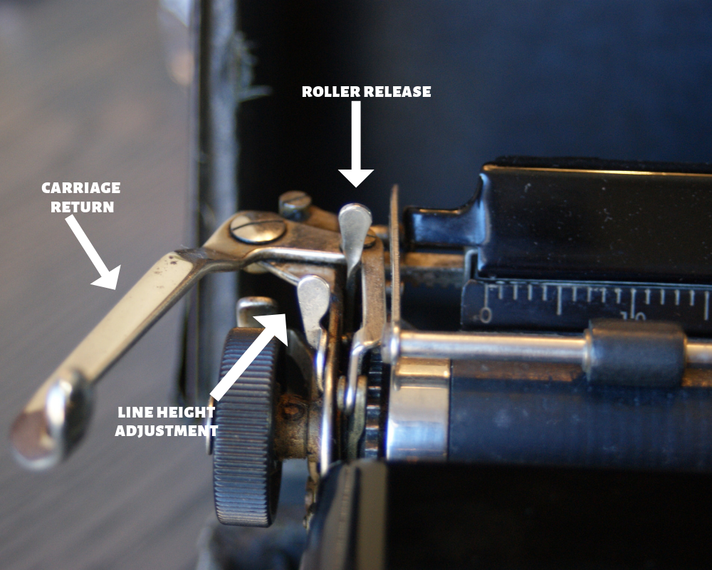

换行符`\r\n`和`\n`的关系和区别可以追溯到60年前，打字机广泛被使用的时代。

在打字机还刚刚被发明的时候，人们输入完一行字之后，需要两个动作才能开始输入下一行的内容。

滚动滚轮，让纸张往上移动一行， 即是 `\n` 操作；
移动 打字的指针到 行首， 即是`\r` 。
上面两个操作没有顺序的要求， 1->2 ; 2->1 都可以。

### windows
 
Windows 操作系统 的文本对 new line的 编码 使用的是 2->1 的 组合操作;
### unix
Linux/Unix 操作系统 则只使用操作 1 。

> A line feed means moving one line forward. The code is `\n`.
A carriage return means moving the cursor to the beginning of the line. The code is `\r`.
Windows editors often still use the combination of both as `\r\n` in text files. Unix uses mostly only the `\n`.

> The separation comes from typewriter times, when you turned the wheel to move the paper to change the line and moved the carriage to restart typing on the beginning of a line. This was two steps

[参考：What is the difference between a “line feed” and a “carriage return”](https://stackoverflow.com/questions/12747722/what-is-the-difference-between-a-line-feed-and-a-carriage-return)

