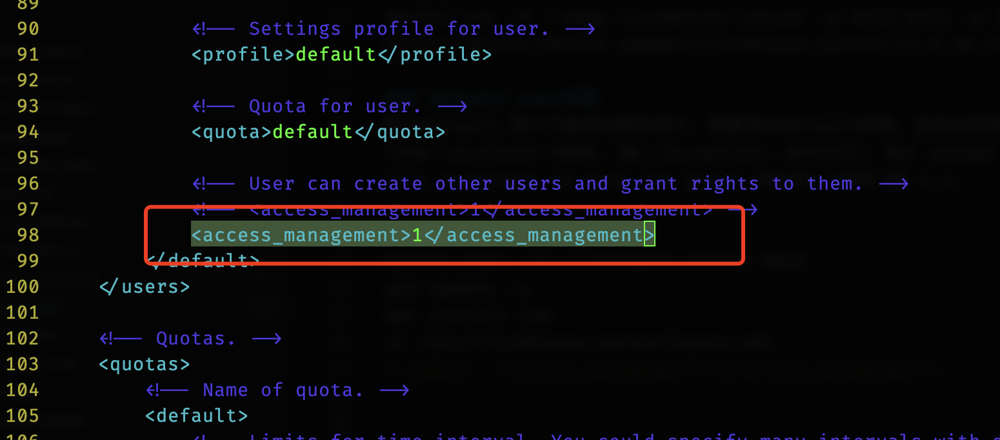

总体来看`clickhouse`的`ddl`操作方式和`mysql`很像。比如`use database_name`， `create user ... identified by ''`等。
## server
### docker run
启动clickhouse服务：
```shell
docker run -d --name clickhouse-server -p 8123:8123 -p 9000:9000 --ulimit nofile=262144:262144 yandex/clickhouse-server:21.8.10.19
```
### default user权限
默认defualt 用户不能添加新的用户，需要修改default权限，否则会报错`Code: 497. DB::Exception: Received from localhost:9000. DB::Exception: default: Not enough privileges. To execute this query it's necessary to have the grant CREATE USER ON *.*.
`:
```shell
docker exec -it clickhouse-server bash
apt update -y
apt install vim
vi /etc/clickhouse-server/users.xml 
# update  <access_management>1</access_management>
exit
docker restart clickhouse-server
```


## client
### docker run client
启动clickhouse client，添加用户和数据库：
```shell
docker run -it --rm --link clickhouse-server:clickhouse-server yandex/clickhouse-client  --host clickhouse-server

## create database
fd87688bfa29 :) create database blc

CREATE DATABASE blc

Query id: 19562cda-a1e7-46f9-a3c2-03dec173e15b

Ok.

0 rows in set. Elapsed: 0.009 sec. 

fd87688bfa29 :) 

## create user
fd87688bfa29 :) create user abc IDENTIFIED by 'ssss'

CREATE USER abc IDENTIFIED WITH sha256_hash BY '28E51044F4A9CBAE2BBD3D8A9D8C902AD1455D42208277AC4A913B003038A3DC'

Query id: ee533fe8-7d66-428a-bbde-89d0a4d15924

Ok.

0 rows in set. Elapsed: 0.002 sec. 

## grant 
fd87688bfa29 :) GRANT ALL PRIVILEGES ON blc. * TO abc

GRANT SHOW, SELECT, INSERT, ALTER, CREATE DATABASE, CREATE TABLE, CREATE VIEW, CREATE DICTIONARY, CREATE FUNCTION, DROP, TRUNCATE, OPTIMIZE, SYSTEM MERGES, SYSTEM TTL MERGES, SYSTEM FETCHES, SYSTEM MOVES, SYSTEM SENDS, SYSTEM REPLICATION QUEUES, SYSTEM DROP REPLICA, SYSTEM SYNC REPLICA, SYSTEM RESTART REPLICA, SYSTEM RESTORE REPLICA, SYSTEM FLUSH DISTRIBUTED, dictGet ON blc.* TO abc

Query id: cd09b798-f7e0-45f7-8511-9914de75238c

Ok.

0 rows in set. Elapsed: 0.002 sec. 

fd87688bfa29 :) 
```

## sdk
### connect from golang client
```golang
package db

import (
	"database/sql"

	_ "github.com/ClickHouse/clickhouse-go"
)

var globalDB *sql.DB

// Init open connection to clickhouse and check a ping cmd.
// url: 'tcp://localhost:9000?debug=true&username=abc&password=ssss&database=blc'

func Init(url string) (func(), error) {
	connect, err := sql.Open("clickhouse", url)
	if err != nil {
		return nil, err
	}
	if err := connect.Ping(); err != nil {
		return nil, err
	}
	globalDB = connect
	return func() { connect.Close() }, nil
}

// Start create tables if not exists.
func Start() error {
	return createTables()
}

```
