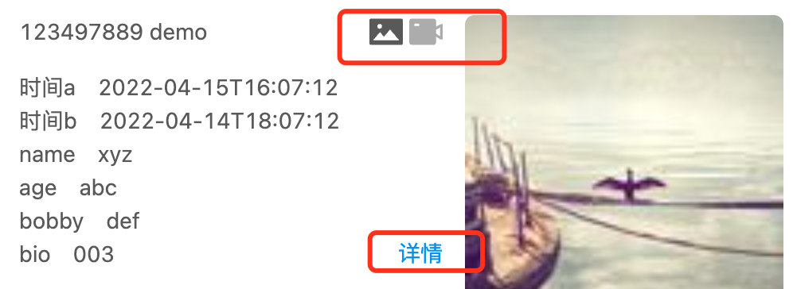

## 问题



上面的两个`icon`和`详情`超级链接，用`margin/padding`属性无法做到原型稿要求的样式。

### 解决方案

[positiion](https://www.w3schools.com/css/css_positioning.asp)
> The position property specifies the type of positioning method used for an element (static, relative, fixed, absolute or sticky).

上面`card` UI组件的两个`svg`图标和`详情`应该使用`position: absolute`属性，它们最近的祖先`div`应该使用`position: relative`属性：
```jsx
iv style={{display: "flex", justifyContent: "space-between", height: "18.5vh"}}>
    <div style={{width: "280px", overflow: "hidden", whiteSpace:'nowrap',
    position: "relative", 
  }}>
      <div style={{position: "absolute", right: '1em', display: 'flex', gap: ".3em"}}>
          <div onClick={this.showPic} style={{opacity: this.state.show === "pic" ? 1 : 0.5 }}>
            <svg viewBox="64 64 896 896" focusable="false" data-icon="picture" width="1.5em" height="1.5em" fill="currentColor" aria-hidden="true">
            <path d="M928 160H96c-17.7 0-32 14.3-32 32v640c0 17.7 14.3 32 32 32h832c17.7 0 32-14.3 32-32V192c0-17.7-14.3-32-32-32zM338 304c35.3 0 64 28.7 64 64s-28.7 64-64 64-64-28.7-64-64 28.7-64 64-64zm513.9 437.1a8.11 8.11 0 0 1-5.2 1.9H177.2c-4.4 0-8-3.6-8-8 0-1.9.7-3.7 1.9-5.2l170.3-202c2.8-3.4 7.9-3.8 11.3-1 .3.3.7.6 1 1l99.4 118 158.1-187.5c2.8-3.4 7.9-3.8 11.3-1 .3.3.7.6 1 1l229.6 271.6c2.6 3.3 2.2 8.4-1.2 11.2z">
            </path>
            </svg>
          </div>
          <div onClick={this.showVideo} style={{opacity: this.state.show === "video"? 1 : 0.5}}>
            <svg viewBox="64 64 896 896" focusable="false" data-icon="video-camera" width="1.5em" height="1.5em" fill="currentColor" aria-hidden="true">
            <path d="M912 302.3L784 376V224c0-35.3-28.7-64-64-64H128c-35.3 0-64 28.7-64 64v576c0 35.3 28.7 64 64 64h592c35.3 0 64-28.7 64-64V648l128 73.7c21.3 12.3 48-3.1 48-27.6V330c0-24.6-26.7-40-48-27.7zM328 352c0 4.4-3.6 8-8 8H208c-4.4 0-8-3.6-8-8v-48c0-4.4 3.6-8 8-8h112c4.4 0 8 3.6 8 8v48zm560 273l-104-59.8V458.9L888 399v226z">
            </path></svg>
          </div>
      </div>
        <p style={{textAlign: "right", position: 'absolute', bottom: 0, right: "1em"}}>
                <a href="/#/bussinessCenter/events">详情</a>
        </p>
        {
        /* 
        .....
        <p style={{marginBottom: 0}}>
            <span>name</span>
            <span style={{marginLeft: "1em"}}>{event.time}</span>
        </p>
        ....
         */
        }

    </div>
    <div style={{width: "200px"}}>
        {this.state.show === "pic" ?
           :
          <video src={event.video_url}></video>
        }
    </div>
</div>

```
## position介绍
The position property specifies the type of positioning method used for an element.

Elements are then positioned using the `top`, `bottom`, `left`, and `right` properties. However, these properties(`top/bottom/left/right`) will **not work** unless the position property is set first. 

They(`top/bottom/left/right`) also work **differently** depending on the position value.


### static
HTML elements are positioned static by default.

Static positioned elements are **not affected** by the top, bottom, left, and right properties.

An element with `position: static;` is not positioned in any special way; it is always positioned according to the normal flow of the page.

### relative
An element with `position: relative;` is positioned relative to its normal(`static`) position.

Setting the top, right, bottom, and left properties of a relatively-positioned element will cause it to be adjusted away from its normal position. 

Other content will **not** be adjusted to fit into any gap left by the element.

### fixed
An element with `position: fixed;` is positioned relative to the `viewport`, which means it always stays in the same place even if the page is scrolled.

The top, right, bottom, and left properties are used to position the element.

A fixed element does **not leave** a gap in the page where it would normally have been located.
```css
div.fixed {
  position: fixed;
  bottom: 0;
  right: 0;
}
```
### absolute
An element with `position: absolute;` is positioned relative to the `nearest` positioned ancestor (instead of positioned relative to the viewport, like fixed).

However; if an absolute positioned element has no positioned ancestors, it uses the document `body`, and moves along with page scrolling.

Note: Absolute positioned elements are **removed from** the normal flow, and can overlap elements.

### sticky

An element with `position: sticky;` is positioned based on the user's scroll position.

A sticky element toggles between `relative and fixed`, depending on the scroll position. 

It is positioned relative until a given offset position is met in the viewport - then it "sticks" in place (like position:fixed).

For example, a sticky element sticks to the top of the page (`top: 0`), when you reach its scroll position
```css
div.sticky {
  position: sticky;
  top: 0;
}
```
