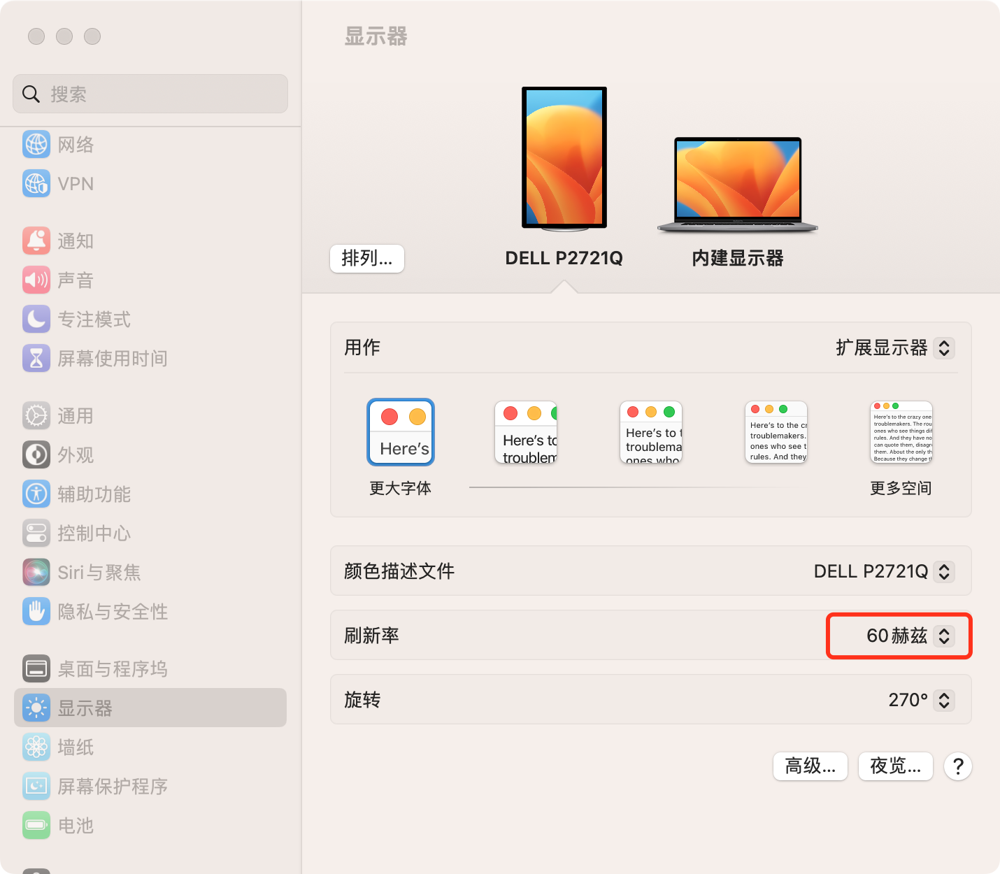

上周五，外接的显示器无故变的很模糊，重新插拔甚至黑屏提示没信号，

重新插拔type-c线后，能识别到显示器了，不过字体和画面还是比较模糊。

打开设置，查看显示器，发现分辨率设置的不对， 默认是1080p了，刷新率也变的很奇怪是59.86。

仔细翻找了下，设置里没看到分辨率4k的选项，刷新率剩下30hz等更低的选项。

这是为什么呢？ 印象中自动识别的就是4k不用设置啥的。

开始抱怨dell的品控做的不行，1年多就gg了。 胡乱的把分辨率设置为2k， 刷新率选了最高 59.86，下班过周末去了。

今天上班开机外接的显示器慢于内建的显示器点亮，也是很奇怪。

午睡起来，外接的显示器彻底歇菜。 联系IT，提工单，然后换了根type-c连接线，4k屏又回来了。

打开设置，看显示器 根本就没有分辨率的选项。 

这才是正常的状态。

## 感悟
1. 软件只是锦上添花，不能雪中送炭；
2. 硬件坏是会有提前征兆的，不要得过且过；
3. 专业的事找专业的人，越早越好。
