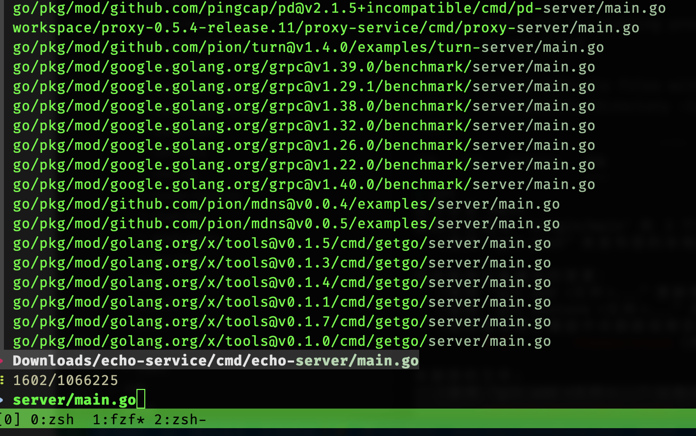

## TLDR;

1. `find`: 有很多过滤规则查找文件/目录/设备，而且可以递归查询某一个目录下的目录或文件，最后除了打印查询结果以外，还可以做其它操作（比如删除该文件）；
2. `locate`: 则简单很多，根据关键字 在缓存index中 检索出含有该关键字的文件或者目录；
3. `fzf`: 实时模糊查询，可以集成到常用的IDE中（比如`fzf.vim`)。

## demo
### find
The syntax of the Find command is:

`find [-H] [-L] [-P] [-D debugopts] [-Olevel] [starting-point...] [expression]`
```shell
#!/bin/bash
find . -name "*tar*gz" -delete
find . -name "*tar*xz" -delete
find . -name "*tar.xz" 
du -sh .
find . -name "*zip*" -delete

find . -type f | perl -lne 'print if -B' | xargs rm -f  # delete all binary files under . recursivly
```

### locate
The syntax of the Locate command is:

`locate [OPTION]... PATTERN..` 

查询`postgreql db`的配置文件：
```shell
#!/bin/bash
locate *hba_conf*
# equal to this
su - postgres
psql
show config_file;
show hba_file;
```

### fzf
```shell
tldr fzf

fzf

Command-line fuzzy finder.
Similar to sk.
More information: https://github.com/junegunn/fzf.

- Start fzf on all files in the specified directory:
  find path/to/directory -type f | fzf

- Start fzf for running processes:
  ps aux | fzf

- Select multiple files with Shift + Tab and write to a file:
  find path/to/directory -type f | fzf --multi > filename

- Start fzf with a specified query:
  fzf --query "query"

- Start fzf on entries that start with core and end with either go, rb, or py:
  fzf --query "^core go$ | rb$ | py$"

- Start fzf on entries that not match pyc and match exactly travis:
  fzf --query "!pyc 'travis"


See also: sk

```

