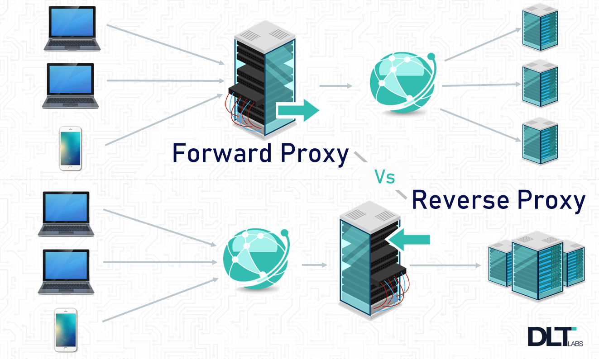
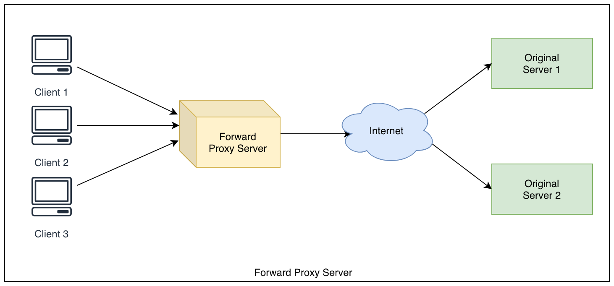
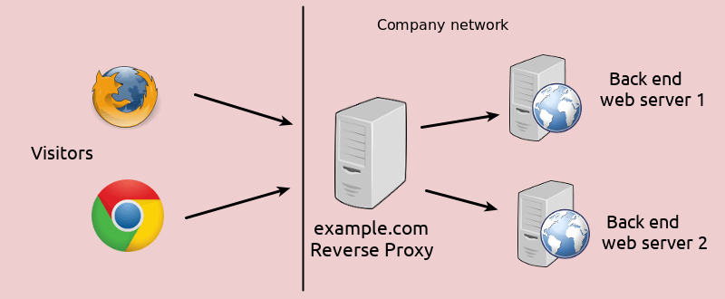

## 代理


### (正向)代理 
代理一般是指正向代理，比如翻墙软件`shadowsocks`就是一种正向代理。 shadowsocks通过`socks 5`协议
在代理服务器上，

代理我们（client）去访问被墙的资源（google/twitter/Facebook等服务器）。



> A proxy server, sometimes referred to as a forward proxy, is a server that routes traffic between client(s) and another system, usually external to the network. By doing so, it can regulate traffic according to preset policies, convert and mask client IP addresses, enforce security protocols, and block unknown traffic.

### 反向代理
反向代理是说我们（client）被代理了， 我们自己还不知道。
我们以为和我们打交道的（处理我们的请求）的是nginx 服务器，其实nginx真正处理我们请求的是ngix后面的`upstream`在
处理我们的请求逻辑。


> A reverse proxy is a type of proxy server.  Unlike a traditional proxy server, which is used to protect clients, a reverse proxy is used to protect servers. A reverse proxy is a server that accepts a request from a client, forwards the request to another one of many other servers, and returns the results from the server that actually processed the request to the client as if the proxy server had processed the request itself. The client only communicates directly with the reverse proxy server and it does not know that some other server actually processed its request.

## config
```nginx
### common set_header

#  /opt/nginx/conf.d/common.proxy;
proxy_hide_header Vary;
proxy_set_header Accept-Encoding '';
proxy_ignore_headers Cache-Control Expires;
proxy_set_header Cookie $http_cookie;
proxy_set_header Referer $http_referer;
proxy_set_header X-Forwarded-Host $host;
proxy_set_header X-Forwarded-Server $host;
proxy_set_header X-Forwarded-For $proxy_add_x_forwarded_for;
proxy_set_header Host $http_host;
proxy_set_header X-Real-IP  $remote_addr;

# csrf
proxy_set_header X-CSRF-TOKEN $http_x_xsrf_token;

proxy_buffer_size 128;
proxy_buffers 16 64k;

proxy_busy_buffers_size         128;
proxy_temp_file_write_size      128;

```

## demo

下面的两个demo都使用了`include  /opt/nginx/conf.d/common.proxy`指令，来包含上面的proxy配置。

### http
```nginx
### demo1-http

upstream upV1 {
    server 172.26.2.5:9090 fail_timeout=0;
    server 172.26.2.6:9090 fail_timeout=0;
}
upstream upV2 {
    server 172.26.2.5:8080 fail_timeout=0;
    server 172.26.2.6:8080 fail_timeout=0;
}

server {
        listen 80 default backlog=16384;
        server_name api.deoops.com;

        access_log  /data/nginx/logs/grafana_access.log  main;
        error_log /data/nginx/logs/grafanar_err.log ;

        include /opt/nginx/conf.d/common.proxy;

        location /v1 {
                proxy_redirect off;
                proxy_pass http://upV1;
        }

        location /v2 {
                proxy_redirect off;
                proxy_pass http://upV2;
        }
}
```

### https

```nginx
### demo2-https

    server {
        listen      443 default ssl;
        server_name deoops.com;
        root        /usr/local/nginx/html;
        index       index.html;

        proxy_ssl_session_reuse off;

        ssl_session_cache    shared:SSL:1m;
        ssl_session_timeout  10m;
        ssl_certificate /var/lib/teleport/deoops.com/cert.pem;
        ssl_certificate_key /var/lib/teleport/deoops.com/key.pem;
        ssl_verify_client off;
        ssl_protocols        SSLv3 TLSv1 TLSv1.1 TLSv1.2;
        ssl_ciphers RC4:HIGH:!aNULL:!MD5;
        ssl_prefer_server_ciphers on;


        location / {
            proxy_redirect              off;
            proxy_set_header            Host            $http_host;
            proxy_set_header            X-Real-IP       $remote_addr;
            proxy_set_header            X-Forwared-For  $proxy_add_x_forwarded_for;
            proxy_pass  https://localhost:33000;
        }
    }
```
