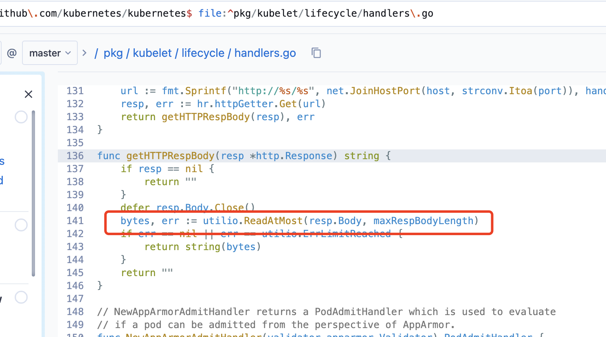
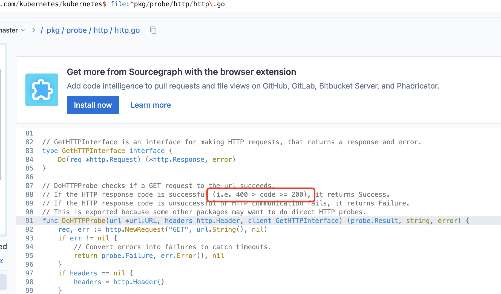

今天测试给我反馈了一个pod问题，测试给出的 use case 描述如下：

配置一个nginx的web服务；
1. 在生命周期中选择http协议，端口配置80，路径配置/errorpath；
2. 服务中pod能正常启动；
3. 预期在pod的事件中应该有一个“FailedPostStartHook”错误信息。
4. 测试人员发现，第4点的预期没有达到，pod 正常启动了，却没有 `FailedPostStarHook`事件出现。

简单分析了一下，我发现是测试人员把pod的`lifecycle`和 pod的`liveness/readiness` 诺混淆了，从而写出了错的test case。

## Lifecycle handlers

首先回顾下pod lifecycle的作用：

```shell
kubectl explain pod.spec.containers.lifecycle.postStart

RESOURCE: postStart <Object>

DESCRIPTION:

     PostStart is called immediately after a container is created. If the

     handler fails, the container is terminated and restarted according to its

     restart policy. Other management of the container blocks until the hook

     completes. More info: https://kubernetes.io/docs/concepts/containers/

     container-lifecycle-hooks/#container-hooks/

 
    Handler defines a specific action that should be taken

```

简单翻译下就是说， `kubernetes` 提供的pod start和exit的 lifecycle hooks 方便开发人员hooked到

下面两个生命周期：

1. 通知外部世界pod已经启动完成 (postStart)
2. pod优雅的退出 (preStop)


ps：`init container`可以解决依赖问题，不要和postStart hooks混淆了哦。

### 举例子
当postStart hook的**handler**发送http请求到指定的port和path时， 如果exit code 不为0时，

会触发 `FailedPostStartHook` 事件，然后执行用户给定的hook/handler。

注意：lifecycle hooks不会理会http 自身的 response code健康与否，

只要**handler** exit code 为0 pod就会正常启动，不触发任何事件。

可以配置一个错误的端口使产生`FailedPostStartHook` event：

```yaml
apiVersion: v1
kind: Pod
metadata:
  name: lifecycle90
spec:
  containers:
  - image: nginx:latest
    name: ng
    imagePullPolicy: Never
    readinessProbe:
      httpGet:
        port: 80
        path: /
    lifecycle:
      postStart:
        httpGet:
          port: 80  ## change this to 8080 or 9090 to get the   FailedPostStartHook event
          path: /teststart
      preStop:
        httpGet:
          port: 80
          path: /teststop

```
### 相关代码
talk is cheap.

`handler`只关心[getHTTPRespBody](https://sourcegraph.com/github.com/kubernetes/kubernetes/-/blob/pkg/kubelet/lifecycle/handlers.go?L72) 获取body的过程是否有err产生， 并不关心http respond code。




## Liveness/readiness probe
pod liveness/readiness **probe** 则会检查 http code 是否为 `2xx`来确定**probe** 是否成功。

### 相关代码
talk is cheap.

[runProbe](https://sourcegraph.com/github.com/kubernetes/kubernetes/-/blob/pkg/kubelet/prober/prober.go?L183) 调用[http.Probe](https://sourcegraph.com/github.com/kubernetes/kubernetes/-/blob/pkg/probe/http/http.go?L129)，`DoHTTPProbe`会检查http response code。





 
从源码可以清楚的看到， lifecyce 的**handler** 只发送了http 请求，并没有检查 http response code,
liveness/readiness 的**prober** 则做了http response code 的检查。
