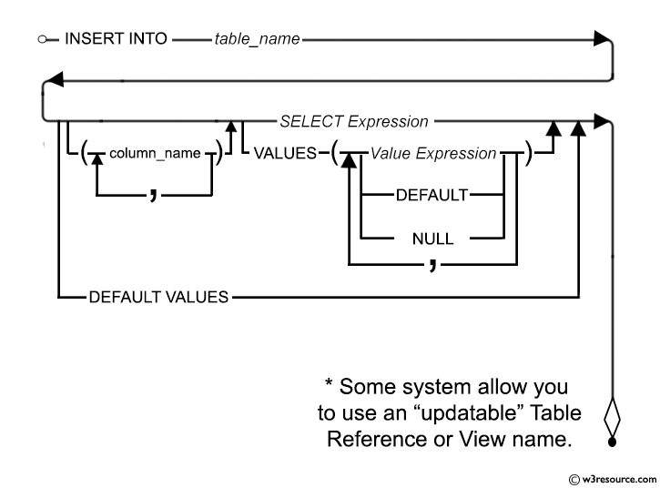

昨天设计了一个quota表，后端代码这样一个初始化的逻辑：

如果quota表为空，则插入一条默认的记录。

上线调试的时候，发现会报错`quotas_pkey duplicated`，而且只会报一次， 重启后端应用不会再报错。

但是清空table之后，重启后端会再报同样的错。

下面是表结构：
```sql
CREATE TABLE  IF NOT EXISTS quotas (
    id SERIAL PRIMARY KEY NOT NULL,
    concurrent smallint NOT NULL DEFAULT 15,
    total smallint NOT NULL DEFAULT 1000,
    speed smallint  NOT NULL DEFAULT 200, 
    created_at TIMESTAMP NOT NULL DEFAULT CURRENT_TIMESTAMP,
    updated_at TIMESTAMP NOT NULL DEFAULT CURRENT_TIMESTAMP
);

```

排查一段时间后发生，是下面一段sql代码的问题：
```sql
-- name: InitQuota :exec
INSERT INTO quotas (id) VALUES (1);
```
这段代码想实现的是插入一条id为1的默认记录。后端是做了判断的，只有quotas表为空的时候才执行这条sql语句。

但是忽略了这条语句不会使得id自增加（postgresql是这样的，mysql没测试过）。

于是当用户插入一条新的quota记录时，就会和已有的`id = 1`的默认记录发生冲突。

## 正确

其实`sql`有专门新增默认值记录的语句：
```sql
-- name: InitQuota :exec
INSERT INTO quotas DEFAULT VALUES;
```



