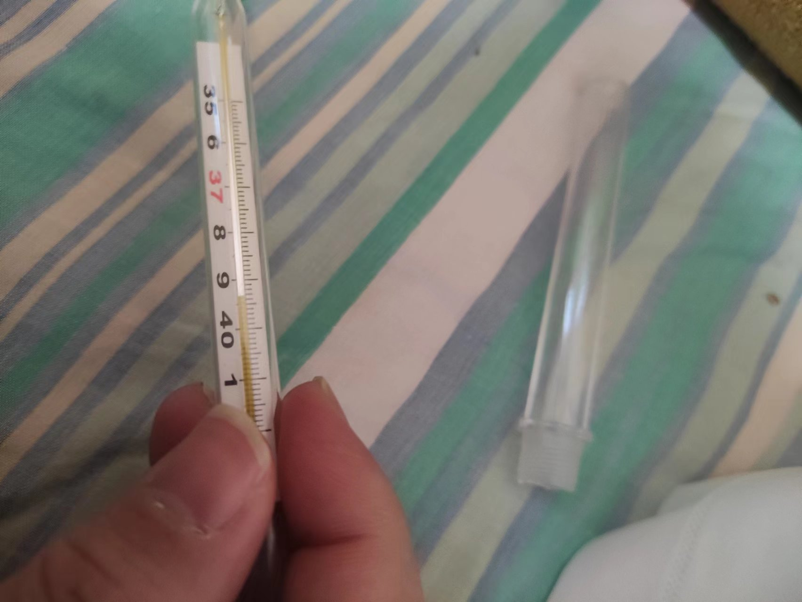

## 新公司
元旦过后入职了新公司，在离家很远的光谷，来回做地铁通勤需要4个小时。

10月份左右，记不太清了，部门搬到江夏。 通勤好了些，来回3小时。

另外6月份的时候部门也搬过一次，从8楼搬到了6楼。

新公司的组织架构变动很频繁，我已经变了3个小组，不知道是怎么决策的，估计是大环境不好吧。

想想整个教培行业没了，不禁唏嘘。

## 铁拳
8月份，派出所的钓鱼执法让我深深的体会到了铁拳无情。 

监督的电话打不通。 腆着个大脸给一个`大人物`亲戚打电话，得到了一些套话和宽慰，自己也得到一些宽慰。

第二天打第二次电话后，还是在电话里得到了一样的东西，自己也死心了。

果然临时抱佛脚没啥用，再说也没有个抱佛脚的样子，应该拿点东西登门拜访的。

啥时候能不卑不亢呢？不亢倒是很简单的。

国家机器是为统治阶级服务的，纸上得来终觉浅啊。哎！

政治应该是为人民服务的，那个时候我只觉自己算个草/屁民。 还好我有理智而且遇事总是犹豫不决，不然那个时候我就极有可能变成刁民了。

我想人人都关心政治的时候，人人都能当上公民了吧。

最近在网上看到自称人矿的人越来越多，记得我刚大学毕业那会大多自称社畜。 

人矿应该是从fuel燃料来的，有一段时间有个段子说：”中国这趟列车这30年来都在高速前进，但是我不是乘客，我是燃料“。 

有人评论到：”难怪这么黑，原来我在油箱里“。

想起一句老话，园丁是蜡烛，燃烧自己照亮他人。

也不知道这句话是铁拳说的，还是蜡烛自己说的， 或者是蜡烛媚上之语，或者是我多想了，这本就是蜡烛肺腑之言。

## 疫情
2022年12月疫情终于逼了一次，我自己也中招了。

起先是喉咙痛了两天，然后头有点晕，晕了大概半天，然后头痛了1天，第3天晚上四肢开始发冷体温39+。

烧了两天39+，最高39.4。两天陆续吃了7颗`对乙酰氨基酚片`烧才退下来。 头一天晚上更加是各4个小时吃一颗，一晚上睡不着，发冷倒寒。

第五天开始咳嗽，咳的脑仁疼，后面慢慢咳嗽不严重了。到现在2023年1月6号，还是有陆陆续续的咳嗽，有时候也胸闷。

整个过程都没有请假，一直在工作，工作效率不咋高。

记得年初上海防疫加码挺多，然后全国都加码了。我关注的一个youtuber说大陆的防疫是政治任务，所有的运动都是政治任务，体育运动也是政治任务。

我不认同这个观点，可悲的是我没有自己的观点。

我应该是有独立思考的能力的，毕竟工作这么长时间了，基本没啥人带过了。

应该是政治/社会的干扰信息（烟雾弹？）太多，有效信息太少（被掩盖？）独立思考之后没结果，以为是自己独立思考能力有问题。

我觉得应该也没人能想明白为啥`仲音`的毫不动摇为啥动摇了，更加不可能解释清楚了。

又多一笔糊涂帐哦。

本就不透明的社会又多了些猪油蒙心的`倀鬼`游荡。

有段时间看海对岸的议员和`柯市长`你来我往相互问候，觉得好笑，现在觉得确实是很好笑的。
