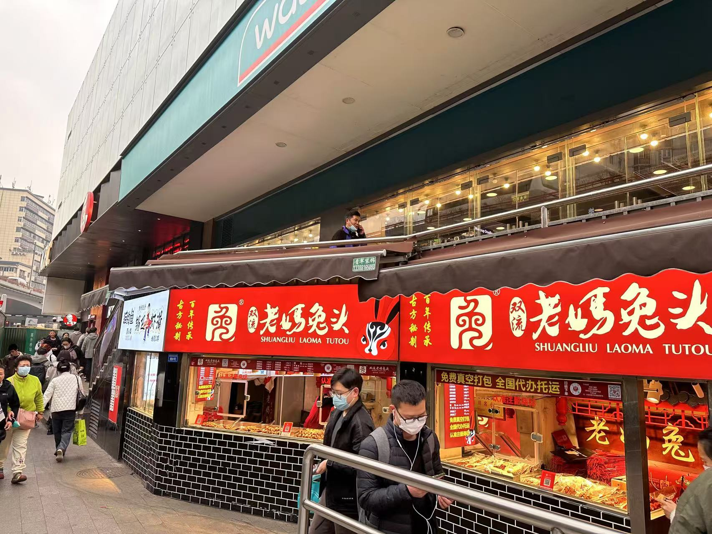

接近两年没写博客了，恰好年终岁末，写个2024年的年终小结。发现2023年的年终总结也没写。

所以补录一个吧。

既然是补录，而且过了快两年，所以难保有些事情记不清了，有些情绪被淡化了。

事情发生的当下，应该是更加快乐，愤怒，伤心的吧。

## 成都出差

2023年的开头，被公司外派去成都出差半个月。记得还是挺冷的，春寒料峭的。

北京的同事打飞的过去，子公司的我坐的高铁过去。所有的差旅报销，也需要通过北京的总部报销。

到了成都，蜀道集团，还真是气派。出差具体的工作细节既不太清了。因为我们去出差只是因为甲方觉得我们驻场的人太少了，

对他们不够重视，然后领导一派脑门就把研发的也弄过去驻场。其实在成都的出差干的事情和在武汉干的一模一样，都是在电脑上写

代码，然后，视频会议对需求。和国企/央企打交道形式主义可不能少。

周末的时候去附近的公园玩了下，什么名字不记得了，但是在高德地图上还是有名的，记得骑着共享单车找了很久才找到的公园入口。

和北京的同事们工作一段时间，吃了个火锅。北京不愧是北方，说来说去，就说到了人际关系上：谁谁谁，是那个那个带出来的，

谁谁谁，谁的什么什么亲戚出演过什么什么电视，谁谁谁，是海归博士啥的，谁谁谁，出差德国啥的。。。北方人侃大山，我不怎么感兴趣。

出差快结束的时候，去大熊猫基地看了看。熊猫比电视上看上去是大了不少，也懒了不少。

## 忙不过来

记得5, 6月份的时候，手上的项目根本忙不过来。我做前端，后端，运维，测试，所有和研发相关的事情。当然还包括和产品经理开会对需求。

很想他们招人来分担分担。但是，可能是这个项目已经在放弃的边缘了，直到7 , 8 月份吧，才招了一个测试过来，还是挂在其他小组的名下，

只是过来帮我们做事情的。

后来还是一直很忙，讽刺的是，8月份评绩效我还是个中等，没意思。

## 上幼儿园

这是一件很开心的事情，小朋友终于上幼儿园了，迈开融入社会的第一步。报名和买房子一样，需要抢着报名。

（2024年的时候，情况就反过来了，幼儿园开始抢生源了。）小朋友上幼儿园很听话，只哭了几次，第一个星期的时候。

交到了几个好朋友，学会了好几首儿歌。认了些字。

问题比较大的是，去幼儿园容易被传染病毒。那个时候正好是闹得厉害，小朋友也肺炎，咳嗽住院了，很心疼啊。

## 裁员
9月份的时候，部门又搞架构调整。我们小组被拆的七七八八的。然后，工作交接的时候，把项目转给我做了。

也没什么评审会，什么的，就口头交给我了。说是很好上手的。等我开发的差不多的时候，我发现其实poc都没过。

我盲目的相信了他们说的话，最后产品的latency指标达不到。我需要来背锅，但是我不是那种背锅的人。

一个什么组长的人，和一个总监在会上压着我，要我加班加点搞好。我自己知道是没意义的，那个项目的架构都错了，

只能推翻重来。不给时间，让我加班加点。我当场就拒绝了。小小组长还给我施压，我就直接说是你的问题，我是不会加班的。

我心里想的是，“你是谁啊，我有问题，有困难的时候，没看到你来帮我，甚至都不知道有你这个人。现在，总监在这里了，

你倒是会说话了，会分析问题了。” 对了，那个组长一上来就问：“这是能力问题，还是什么问题？”，我直接就说了：“是能力问题”。

总监听着我越来约不服管教了，也来下场说，不想搞，现在就可以交辞职报告。我直接来一句：“你是在威胁我吗？我不加班怎么了？我就是不加班”。

其实这么些年来，我不知道加了多少班，有意义的，没意义的班，都加过。在这个公司也加过班。想象以前在其它公司搞运维的时候，通宵几个晚上发版本。

但是一个是话赶话，一个是我真的不想加班，把自己真实的想法说出口了。不过我也不后悔，说实话会受到处罚，早就见怪不怪了。

可能因为我是各高级研发的原因吧，没有立马裁我。

11月的时候，hr找我谈话，我就知道。终于，他们找到便宜货了。应该说便宜而且顺手的货吧。因为我也是各便宜货，只是用起来不顺手。

赶在12月1号要给我缴12月的五险一金之前，他们把我裁了。当然，我也就去劳动仲裁了，要把我的年终奖给要回来。

我的劳动所得，谁也不能轻飘飘的说不给就不给。

最后，在2024年的6月多，快七月了，签了个丧权辱国的保密协议才得到一个相对满意的结果。

拿回自己应得的东西是真的难，不知道以前讨薪的农民工是咋弄的，在这里呼吁大家关注下弱势群体吧。

## 大雪

年末的时候，下了好大的雪。 应该已经是2024年了，我在2024年的年终总结里面写吧。
