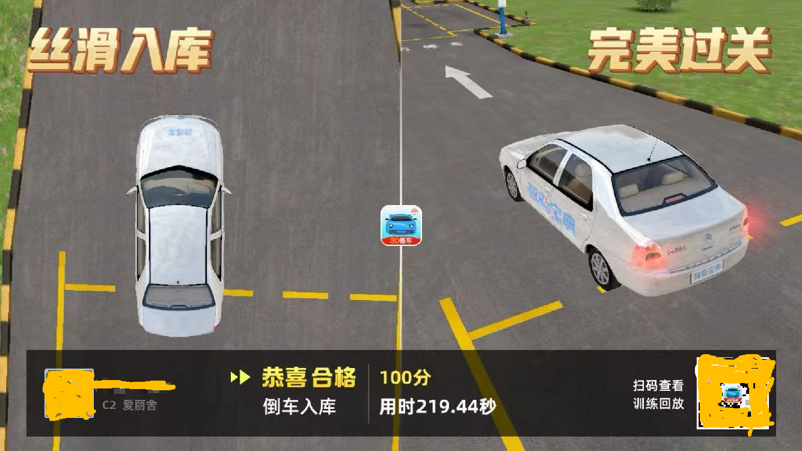
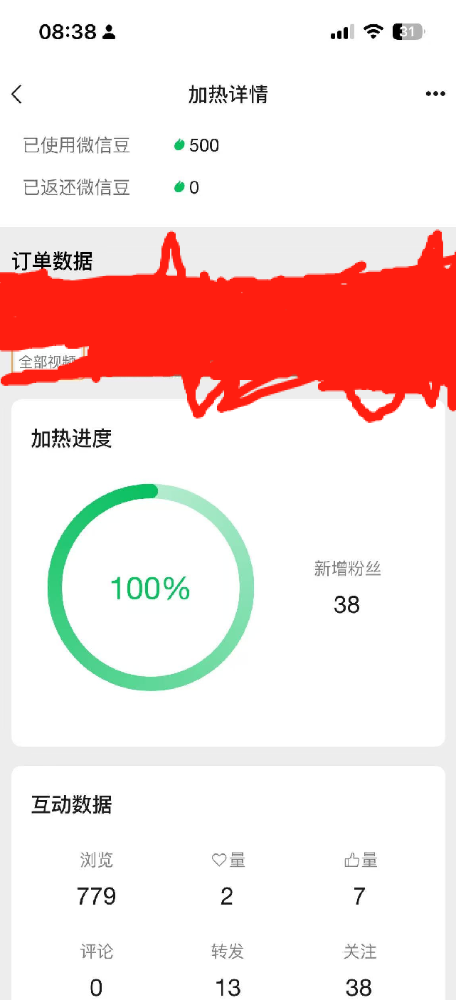
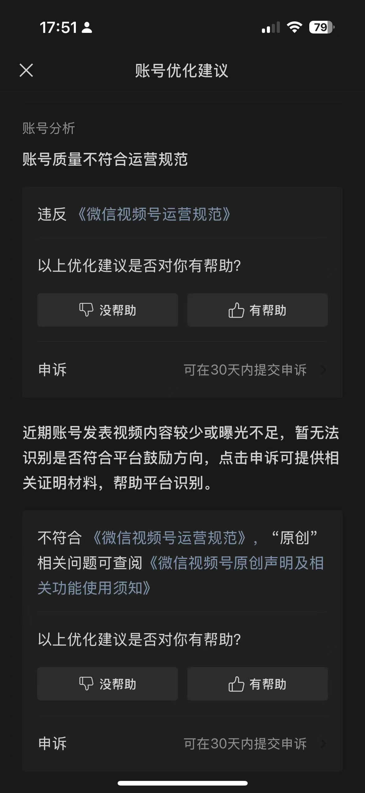

## 大雪

年初武汉下了好大好大的雪。还有人去江滩那里拿个硬纸板滑雪呢。

俗话说瑞雪兆丰年，2024年，我倒是没走啥好运。平静且孤独吧。

下完雪后的，3， 4月分，去踏了踏春：看樱花， 爬龟山，光谷马戏团。。。

## PC

十一年前2013年我DIY了自己的第一台台式机，今年2024年DIY了第二台电脑。

每次都是因为笔记本性能跟不上了。 2011年的华硕笔记本，并没有坚如磐石。2018年的macbook pro能用，但是电池出了问题。

新的PC装了一段时间的windows 11, 玩了一个快两个月的英雄联盟，觉得没意思。就换成了Ubuntu 2024.04, 一直用到现在，蛮好用的。

而且微信和QQ也都出了Linux版本的，不耽误事情。当然，微信是今年下半年才支持的Linux。

我估计是国产操作系统倒逼的鹅厂，现在好些国企/事业单位都只能采购国产的cpu，国产的操作系统了，虽然很难用，但是行政力量大于天。

## 驾校

在武汉考驾照，大家还是多花点钱吧，省心，不遭罪。

具体的坑我可能会单独写一篇文章，在这里就只简单的说下：

整个科目三考过来，给大家一条建议吧，想快速拿证（没时间练车）的，多打点下。有时间的，对自己技术信的过的，建议做好心里准备，一定是大于等于4次才会过。

另外，我科目二也是考了五次，也是没有打点过任何东西。

回想起来除了花了400快打学时外，就是花时间和花补考费了。

## 工作

2024年，一整年，只面试了一场，还是年末高峰期的一场面试。投的简历应该只有四五十份吧。

年初没啥Rust的岗位投，没的投，之后，有岗位了但大多是Web 3的岗位。没意思。

另外，上家公司一直到6月份，我签了丧权辱国的保密协议后才给了我离职证明，也不方便我找工作。

做了一年的Upper, 投了的56个视频，收获了60个粉丝，还不错。

微信视频号上，发些英语学习的视频，有120个粉丝，但是被限流量了，我就不去更新视频号了。

限流也很搞笑，刚刚花90块钱，用所谓的“加热工具”加热了下视频，结果号爆炸了。

我觉得他们应该先提醒我，而不是等我花了钱再说不行，然后也不退钱。

## 新年寄语

新的一年2025年马上就要来了。我又开始写博客了，这是一个好的开始。

新的一年，我希望自己，好好学习，好好生活，家人身体健康。

能个远程的工作，做做奶爸，最好了。

加油!
