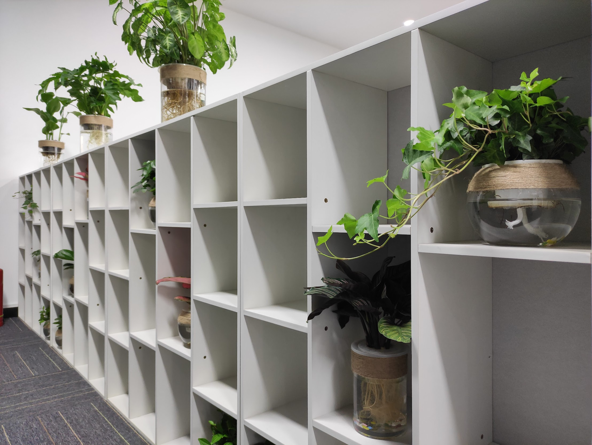

月初的时候同事抱怨公司没有纸巾了，有点儿不方便。
八卦一阵后，原来是说上个月团建超预算了，下个月才有经费采购纸巾。估计还要等20多天。

慢慢的大家的纸巾都用完了，私下的抱怨也越来越多。

到了月中也就不怎么抱怨了，毕竟才几块钱的东西，大家基本上都自己买了。

本来事情很简单过去了。不想前几天公司的老大在办公室逛的时候说了一句，`这些盆栽有的已经枯了，要找人修一修了`。
 
然后今天办公室的盆栽就都换新了:

有一说一，这些盆栽挺漂亮的。

不过公司要是能把没有纸巾的问题解决了，赏花的时候心里会更舒服些，不要**辜负**了绿油油漂亮的盆栽。

ps. 我也不敢提纸巾的时候，忍一忍就过去了哈。
pps. 下午接到通知，大老板要从上海过来。公司还请了保洁阿姨搞卫生。可能是特批了一笔经费吧。
