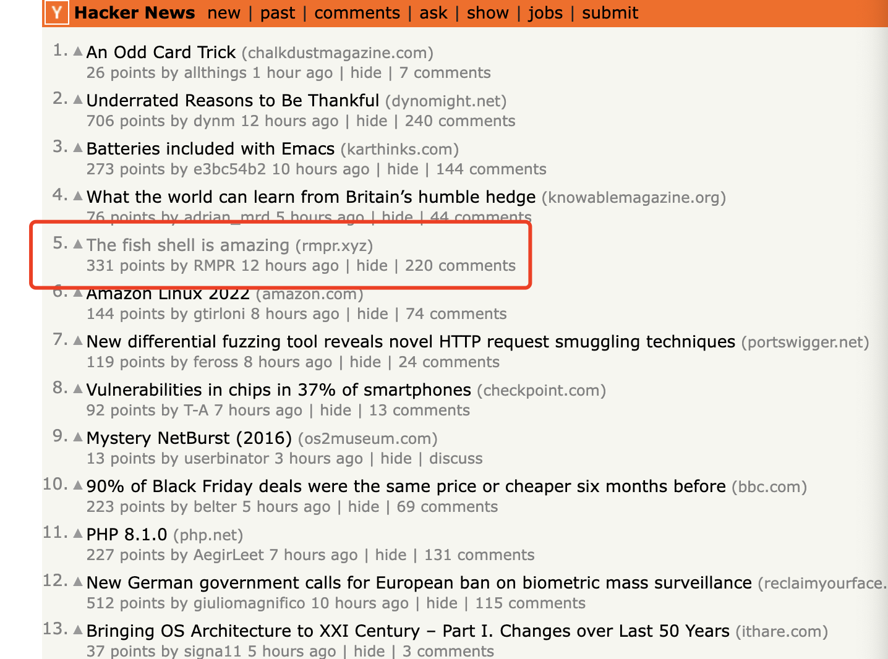

今天在hacker news上闲逛，又看到有人推销`fish`。心想马上就2022年了，不如换个shell耍耍。



其实早在2013年就接触过[fish](https://fishshell.com/)，那个时候自己比较菜，工作的时候很多bash脚本在fish上都不能使用，所以就放弃fish。
## 安装
安装fish
```shell
sudo port install fish
sudo chpass -s /opt/local/bin/fish ${USER}
cat /etc/shells
```
退出`zsh`，重启`terminal`

## 安装插件
### oh-my-fish / fisher
```fish
curl https://raw.githubusercontent.com/oh-my-fish/oh-my-fish/master/bin/install > install
fish install --path=~/.local/share/omf --config=~/.config/omf


# 可能出现 https://git.io无法访问的问题
curl -sL https://git.io/fisher | source && fisher install jorgebucaran/fisher
```

### autojump/ j
```fish
sudo port uninstall autojump

git clone https://github.com/wting/autojump.git
cd autojump/
./install.py
cd repo/github/autojump/
vi .config/fish/config.fish
j home
```

### nvm
```fish
sudo port uninstall nvm
fisher install jorgebucaran/nvm.fish
nvm install latest
nvm list
nvm --version
#nvm use v17.1.0 
#  Now using Node v17.1.0 (npm 8.1.2) ~/.local/share/nvm/v17.1.0/bin/node
node --version
```

### fisher plugins
```fish
fisher install IlanCosman/tide@v5

fisher install PatrickF1/fzf.fish

fisher install franciscolourenco/done
```

## 配置
### PATH
```fish
echo $PATH
fish_add_path /Users/r/go/bin
fish_add_path  /opt/local/bin
```
### alias 
默认`ls`命令对文件和目录没有做颜色的区分，可以使用`alias ls='ls -G'`加上颜色选项:)
```fish
# ~/.config/fish/config.fish 
#starship init fish | source

begin
    if test -f /Users/r/.autojump/share/autojump/autojump.fish; . /Users/r/.autojump/share/autojump/autojump.fish; end
    set --local AUTOJUMP_PATH $HOME/.autojump/share/autojump/autojump.fish
    if test -e $AUTOJUMP_PATH
        source $AUTOJUMP_PATH
    end
end

begin
    alias ls='ls -G'
    alias yaegi='rlwrap yaegi'
    #alias swagger="docker run --rm -it -e GOPATH=$HOME/go:/go -v $HOME:$HOME -w $(pwd) quay.io/goswagger/swagger"
    alias kks='kubectl -n kube-system '
    alias kku='kubectl -n wu '
    alias kkl='kubectl -n location '
    alias pt='git push && git push --tags'
    alias vi=nvim
    alias vim=nvim
    # alias code=nvim
    alias t='tmux -u'
    # alias docker_prune="docker rmi `docker images -f 'dangling=true' -q`"
    # alias docker_prune="docker system prune"
    alias chrome="/Applications/Google\ Chrome.app/Contents/MacOS/Google\ Chrome"
end


begin
    set --universal nvm_default_version v17.3.1
end
```
