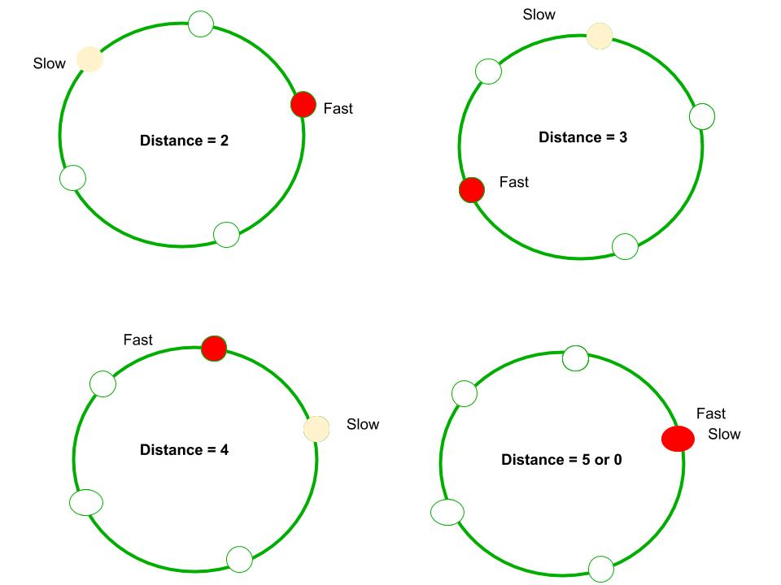

4月份腾讯面试的时候被问到如何在空间复杂度为O（1）前提下检查连表是否为闭环：

当时没想出来，面试官提醒用快慢指针也没写出来。

回到家里想了下，其实当时已经想出来了，没敢写出来:

```golang
func circular(head *ListNode) bool {
    slow, fast := head, head
    for fast != nil && fast.Next != nil {
        slow = slow.Next
        fast = fast.Next.Next
        if slow == fast {
            return true
        }
    }
    return false
}
```



