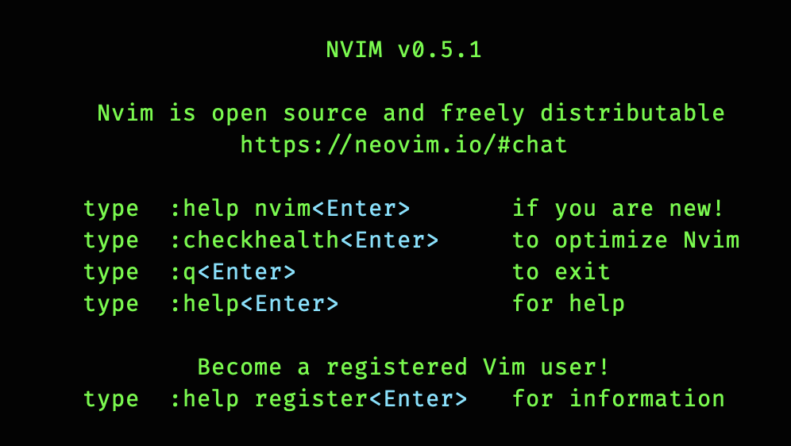

使用vim有7，8年了，整理一下自己用到的vim配置，方便自查。

## vim
### basic
基本设置，语法高亮，行号，等等：
```vimrc
execute pathogen#infect()
syntax on
filetype plugin indent on
set number
``` 
### paste
复制粘贴：
[disable auto indent](https://stackoverflow.com/questions/2514445/turning-off-auto-indent-when-pasting-text-into-vim)
```vimrc
set paste
```
>  Notice the “– INSERT (paste) –” at the bottom of the Vim window.
### fold
代码折叠：
[Folding wiki](http://vim.wikia.com/wiki/Folding)
```vimrc
" close  zc
" open zo
```

### font
安装字体：
[install powerline font](https://github.com/powerline/powerline)
```shell
wget https://github.com/powerline/powerline/raw/develop/font/PowerlineSymbols.otf  
open .
# double click the otf file you've just downloaded.
```

### kubectl eidt issue
使用`kubectl  edit`时，当yaml文件的annotation行过大会报错:

`annotation: kubectl.kubernetes.io/last-applied-configuration is too large`
```vimrc
" annotation: kubectl.kubernetes.io/last-applied-configuration
" is too large
set maxmempattern=200000
```

## neovim


今年（2020），我从vim 8 迁移到了`neovim`，下面是 `~/.config/nvim/init.vim`的配置内容

```vimrc
" cp from ~/.vimrc
" execute pathogen#infect()
"syntax on
"filetype plugin indent on
language en_US.UTF-8

set rtp+=/usr/local/opt/fzf
set number
set encoding=utf-8

" You need to set ignorecase if you want to use what smartcase provides
set ignorecase
set smartcase

" kubectl edit
" annotation: kubectl.kubernetes.io/last-applied-configuration
" is too large
set maxmempattern=200000
"set foldmethod=syntax
"set clipboard=unnamed

"autocmd vimenter * NERDTree
"
"autocmd StdinReadPre * let s:std_in=1
"autocmd VimEnter * if argc() == 0 && !exists("s:std_in") | NERDTree | endif

autocmd StdinReadPre * let s:std_in=1
autocmd VimEnter * if argc() == 1 && isdirectory(argv()[0]) && !exists("s:std_in") | exe 'NERDTree' argv()[0] | wincmd p | ene | exe 'cd '.argv()[0] | endif

call plug#begin(stdpath('data') .'/plugged')
" call plug#begin('~/.vim/plugged')
" Make sure you use single quotes
"
Plug 'tpope/vim-commentary'
Plug 'vim-airline/vim-airline'
Plug 'vim-airline/vim-airline-themes'
" " Shorthand notation; fetches https://github.com/junegunn/vim-easy-align
Plug 'junegunn/vim-easy-align'
"
" " Any valid git URL is allowed
Plug 'https://github.com/junegunn/vim-github-dashboard.git'
"
" " Multiple Plug commands can be written in a single line using | separators
Plug 'SirVer/ultisnips' | Plug 'honza/vim-snippets'
"
" " On-demand loading
Plug 'scrooloose/nerdtree', { 'on':  'NERDTreeToggle' }
Plug 'preservim/tagbar'


" Plug 'tpope/vim-fireplace', { 'for': 'clojure' }
"
" " Using a non-default branch
Plug 'rdnetto/YCM-Generator', { 'branch': 'stable' }
"
" " Using a tagged release; wildcard allowed (requires git 1.9.2 or above)
Plug 'fatih/vim-go', { 'do': ':GoUpdateBinaries' }
"
"
" " Plugin outside ~/.vim/plugged with post-update hook
Plug 'junegunn/fzf', { 'dir': '~/.fzf', 'do': './install --all' }
Plug 'junegunn/fzf.vim'

" Track the engine.
Plug 'SirVer/ultisnips'
"
" Snippets are separated from the engine. Add this if you want them:
Plug 'honza/vim-snippets'

if has('nvim')
  Plug 'Shougo/deoplete.nvim', { 'do': ':UpdateRemotePlugins' }
else
  Plug 'Shougo/deoplete.nvim'
  Plug 'roxma/nvim-yarp'
  Plug 'roxma/vim-hug-neovim-rpc'
endif
Plug 'tpope/vim-sensible'

Plug 'rust-lang/rust.vim'

" for reactjs jsx
"
"
"
Plug 'pangloss/vim-javascript'
Plug 'leafgarland/typescript-vim'
Plug 'peitalin/vim-jsx-typescript'
Plug 'styled-components/vim-styled-components', { 'branch': 'main' }

" Plug 'autozimu/LanguageClient-neovim', {'branch': 'next', 'do': 'bash install.sh' }
"Plug 'jparise/vim-graphql'

"Plug 'neoclide/coc.nvim', {'branch': 'release'}
call plug#end()

" let g:coc_global_extensions = ['coc-json', 'coc-tsserver']

" for js/ts synax
" syntax highlighting can get out of sync i
" https://thoughtbot.com/blog/modern-typescript-and-react-development-in-vim
autocmd BufEnter *.{js,jsx,ts,tsx} :syntax sync fromstart
autocmd BufLeave *.{js,jsx,ts,tsx} :syntax sync clear

let g:deoplete#enable_at_startup = 1

let g:go_def_mode='gopls'
let g:go_info_mode='gopls'

let g:UltiSnipsEditSplit="vertical"

call deoplete#custom#option('omni_patterns', { 'go': '[^. *\t]\.\w*' })


"set list
"set listchars=tab:>-
set tabstop=4
"
"set expandtab
"set shiftwidth=2
set autoindent
set smartindent
"

let mapleader=','	

nmap <C-P> :FZF<CR>

let NERDTreeShowHidden=1


" If more than one window and previous buffer was NERDTree, go back to it.
autocmd BufEnter * if bufname('#') =~# "^NERD_tree_" && winnr('$') > 1 | b# | endif
let g:plug_window = 'noautocmd vertical topleft new'

if has('nvim')
  "highlight! link TermCursor Cursor
  highlight! TermCursorNC guibg=red guifg=white ctermbg=1 ctermfg=15
endif

set clipboard+=unnamedplus
let g:go_imports_autosave = 1

" nmap <silent> gd <Plug>(coc-definition)
" nmap <silent> gy <Plug>(coc-type-definition)
" nmap <silent> gr <Plug>(coc-references)
" nmap <leader>rn <Plug>(coc-rename)
"let g:LanguageClient_serverCommands = {'javascript': ['javascript-typescript-stdio']}


```
