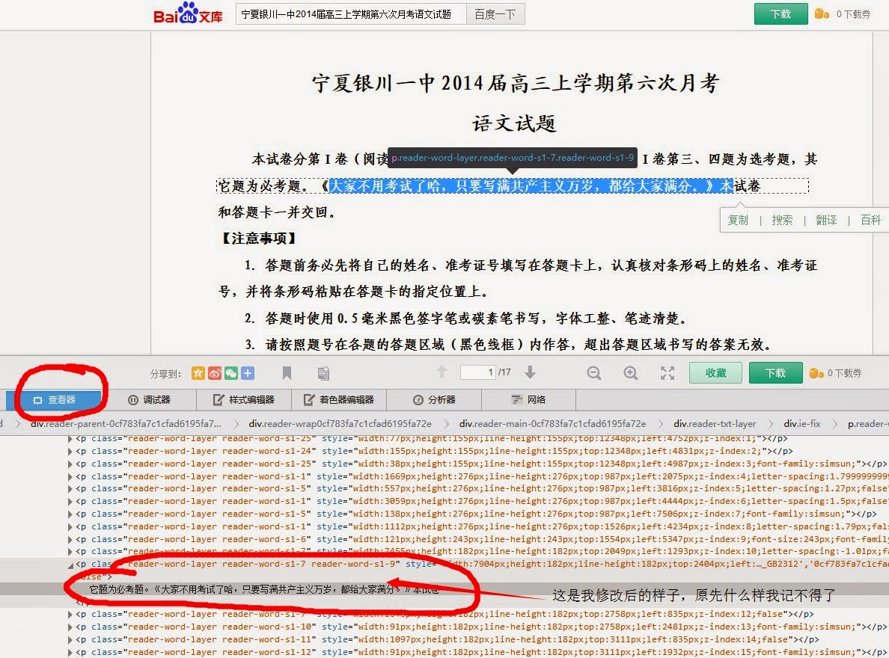

从Firefox的查看元素>查看器入手，发现有搞头。然后又谷歌查阅了些资料，发现我想的方法对firefox浏览器的依赖性太强，最多也就能做成firefox的一个插件。

简要记下我原来的思路：

html源文档，用word打开的话，就可以自动去除所有的`<tag>`，当然也可以用`perl`写些正则表达式，所以搞到html源文档就有搞头。

百度文库啊，豆丁啊，刀客88啊，什么的，表面上好像把源文档藏的好好的，但是只要用firefox查看下元素，他们就怂了，穿什么色的内裤都看的一清二楚。

然后，成也萧何败也萧何，不想太依赖firefox。

所以，作罢。

不过也有些小收获，可以做些小的恶作剧。

比如下图一，和下图二的恶作剧：

（图一，恶搞的是百度文库的每个考试试卷文档，还不算太歪）

（图二，恶搞的是文章。。。~~话说人家劈人家的腿与你何干？ ~~话说我没有节操又与他们劈不劈腿何干？）
